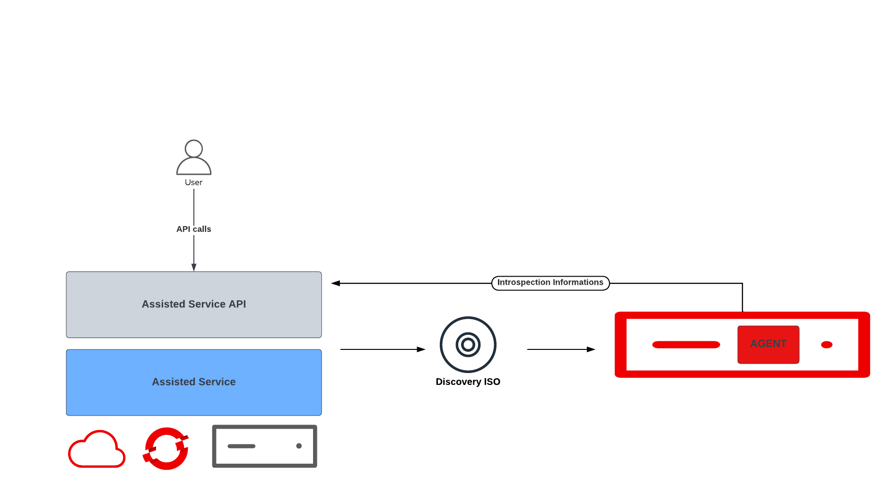
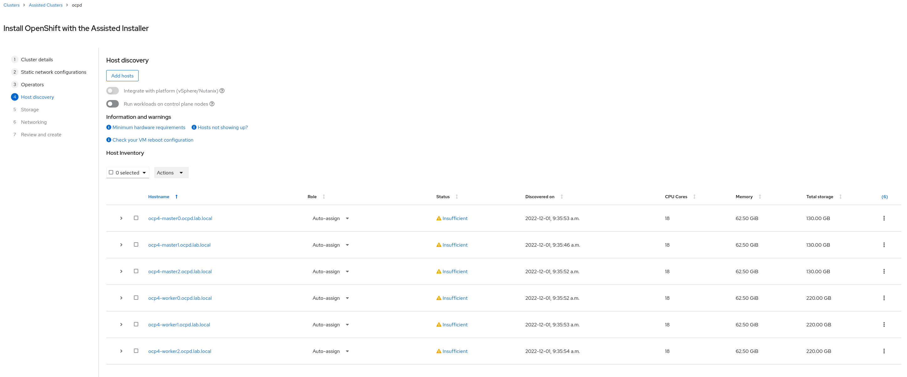
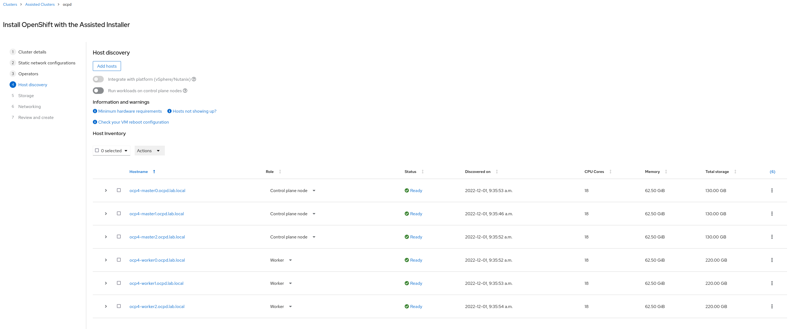

# Assisted Installer Lab 
Assisted Installer provides a service that installs OpenShift. Its main benefits include a minimum amount of prerequisites from the user's infrastructure, as well as comprehensive pre-flight validations to ensure a successful installation. The service exposes either a REST API, or it can be deployed as an **Operator** where it exposes a Kubernetes-native API via Custom Resources. A UI is available that uses the REST API. For this presentation the Podman version will be used
 <br />
<br />
## API Flow Description <br />
<br /><br />




<br /><br /><br />

 1. Cluster object creation 
 2. Infra object creation
 3. The Discovery  ISO is created, downloaded and booted from by all nodes
 4. The agent service is started on the nodes and sends introspection informations to the assisted service for validation
 5. User assigns roles to Nodes and triggers the deployment
 6. User can monitor the status of installation through API or GUI


## Assisted Service installation

- Prerequistes
    - A KVM host with lots of RAM and fast SSDs
    - A libvirt pool and network ready to use
    - Podman installed and running


- Getting the bits  

    ```bash
    git clone https://github.com/openshift/assisted-service.git 
    cd assisted-service 
    git checkout -b demo-ai
    cd deploy/podman
    ```
- Configure the service by editing configmap.yaml

    ```bash
    apiVersion: v1
    kind: ConfigMap
    metadata:
    name: config
    data:
    ASSISTED_SERVICE_HOST: 127.0.0.1:8090
    ASSISTED_SERVICE_SCHEME: http
    AUTH_TYPE: none
    DB_HOST: 127.0.0.1
    DB_NAME: installer
    DB_PASS: admin
    DB_PORT: "5432"
    DB_USER: admin
    DEPLOY_TARGET: onprem
    DISK_ENCRYPTION_SUPPORT: "true"
    DUMMY_IGNITION: "false"
    ENABLE_SINGLE_NODE_DNSMASQ: "true"
    HW_VALIDATOR_REQUIREMENTS: '[{"version":"default","master":{"cpu_cores":4,"ram_mib":16384,"disk_size_gb":100,"installation_disk_speed_threshold_ms":10,"network_latency_threshold_ms":100,"packet_loss_percentage":0},"worker":{"cpu_cores":2,"ram_mib":8192,"disk_size_gb":100,"installation_disk_speed_threshold_ms":10,"network_latency_threshold_ms":1000,"packet_loss_percentage":10},"sno":{"cpu_cores":8,"ram_mib":16384,"disk_size_gb":100,"installation_disk_speed_threshold_ms":10},"edge-worker":{"cpu_cores":2,"ram_mib":8192,"disk_size_gb":15,"installation_disk_speed_threshold_ms":10}}]'
    IMAGE_SERVICE_BASE_URL: http://127.0.0.1:8888
    IPV6_SUPPORT: "true"
    ISO_IMAGE_TYPE: "full-iso"
    LISTEN_PORT: "8888"
    NTP_DEFAULT_SERVER: "10.17.3.1"
    OS_IMAGES: '[{"openshift_version":"4.8","cpu_architecture":"x86_64","url":"https://mirror.openshift.com/pub/openshift-v4/x86_64/dependencies/rhcos/4.8/4.8.14/rhcos-4.8.14-x86_64-live.x86_64.iso","version":"48.84.202109241901-0"},{"openshift_version":"4.9","cpu_architecture":"x86_64","url":"https://mirror.openshift.com/pub/openshift-v4/x86_64/dependencies/rhcos/4.9/4.9.45/rhcos-4.9.45-x86_64-live.x86_64.iso","version":"49.84.202207192205-0"},{"openshift_version":"4.10","cpu_architecture":"x86_64","url":"https://mirror.openshift.com/pub/openshift-v4/x86_64/dependencies/rhcos/4.10/4.10.37/rhcos-4.10.37-x86_64-live.x86_64.iso","version":"410.84.202210040010-0"},{"openshift_version":"4.10","cpu_architecture":"arm64","url":"https://mirror.openshift.com/pub/openshift-v4/aarch64/dependencies/rhcos/4.10/4.10.37/rhcos-4.10.37-aarch64-live.aarch64.iso","version":"410.84.202210040011-0"},{"openshift_version":"4.11","cpu_architecture":"x86_64","url":"https://mirror.openshift.com/pub/openshift-v4/x86_64/dependencies/rhcos/4.11/4.11.9/rhcos-4.11.9-x86_64-live.x86_64.iso","version":"411.86.202210041459-0"},{"openshift_version":"4.11","cpu_architecture":"arm64","url":"https://mirror.openshift.com/pub/openshift-v4/aarch64/dependencies/rhcos/4.11/4.11.9/rhcos-4.11.9-aarch64-live.aarch64.iso","version":"411.86.202210032347-0"},{"openshift_version":"4.12","cpu_architecture":"x86_64","url":"https://mirror.openshift.com/pub/openshift-v4/x86_64/dependencies/rhcos/pre-release/4.12.0-ec.2/rhcos-4.12.0-ec.2-x86_64-live.x86_64.iso","version":"412.86.202208101039-0"},{"openshift_version":"4.12","cpu_architecture":"arm64","url":"https://mirror.openshift.com/pub/openshift-v4/aarch64/dependencies/rhcos/pre-release/4.12.0-ec.2/rhcos-4.12.0-ec.2-aarch64-live.aarch64.iso","version":"412.86.202208101040-0"}]'
    POSTGRESQL_DATABASE: installer
    POSTGRESQL_PASSWORD: admin
    POSTGRESQL_USER: admin
    PUBLIC_CONTAINER_REGISTRIES: 'quay.io'
    RELEASE_IMAGES: '[{"openshift_version":"4.8","cpu_architecture":"x86_64","cpu_architectures":["x86_64"],"url":"quay.io/openshift-release-dev/ocp-release:4.8.53-x86_64","version":"4.8.53"},{"openshift_version":"4.9","cpu_architecture":"x86_64","cpu_architectures":["x86_64"],"url":"quay.io/openshift-release-dev/ocp-release:4.9.52-x86_64","version":"4.9.52"},{"openshift_version":"4.10","cpu_architecture":"x86_64","cpu_architectures":["x86_64"],"url":"quay.io/openshift-release-dev/ocp-release:4.10.42-x86_64","version":"4.10.42"},{"openshift_version":"4.10","cpu_architecture":"arm64","cpu_architectures":["arm64"],"url":"quay.io/openshift-release-dev/ocp-release:4.10.42-aarch64","version":"4.10.42"},{"openshift_version":"4.11","cpu_architecture":"x86_64","cpu_architectures":["x86_64"],"url":"quay.io/openshift-release-dev/ocp-release:4.11.13-x86_64","version":"4.11.13","default":true},{"openshift_version":"4.11","cpu_architecture":"arm64","cpu_architectures":["arm64"],"url":"quay.io/openshift-release-dev/ocp-release:4.11.13-aarch64","version":"4.11.13"},{"openshift_version":"4.11.0-multi","cpu_architecture":"multi","cpu_architectures":["x86_64","arm64","ppc64le","s390x"],"url":"quay.io/openshift-release-dev/ocp-release:4.11.0-multi","version":"4.11.0-multi"},{"openshift_version":"4.12","cpu_architecture":"x86_64","cpu_architectures":["x86_64"],"url":"quay.io/openshift-release-dev/ocp-release:4.12.0-rc.1-x86_64","support_level":"beta","version":"4.12.0-rc.1"},{"openshift_version":"4.12","cpu_architecture":"arm64","cpu_architectures":["arm64"],"url":"quay.io/openshift-release-dev/ocp-release:4.12.0-rc.1-aarch64","support_level":"beta","version":"4.12.0-rc.1"}]'
    SERVICE_BASE_URL: http://10.17.3.1:8090
    STORAGE: filesystem
    ENABLE_UPGRADE_AGENT: "false"
    ```
- Deploy the service and watch the pod being created
  
  ```bash
  podman play kube --configmap configmap.yml pod.yml
  podman pod ps

- Monitor the API availability
  
  ```bash
  podman logs -f assisted-installer-image-service
  {"file":"/go/src/github.com/openshift/origin/pkg/imagestore/imagestore.go:210","func":"github.com/openshift/assisted-image-service/pkg/imagestore.(*rhcosStore).Populate","level":"info","msg":"Creating minimal iso for 4.11-411.86.202210032347-0-arm64","time":"2022-11-26T11:40:58Z"}
    {"file":"/go/src/github.com/openshift/origin/pkg/imagestore/imagestore.go:223","func":"github.com/openshift/assisted-image-service/pkg/imagestore.(*rhcosStore).Populate","level":"info","msg":"Finished creating minimal iso for 4.11-arm64 (411.86.202210032347-0)","time":"2022-11-26T11:41:01Z"}
    {"file":"/go/src/github.com/openshift/origin/pkg/imagestore/imagestore.go:210","func":"github.com/openshift/assisted-image-service/pkg/imagestore.(*rhcosStore).Populate","level":"info","msg":"Creating minimal iso for 4.12-412.86.202208101039-0-x86_64","time":"2022-11-26T11:41:01Z"}
    {"file":"/go/src/github.com/openshift/origin/pkg/imagestore/imagestore.go:223","func":"github.com/openshift/assisted-image-service/pkg/imagestore.(*rhcosStore).Populate","level":"info","msg":"Finished creating minimal iso for 4.12-x86_64 (412.86.202208101039-0)","time":"2022-11-26T11:41:04Z"}
    {"file":"/go/src/github.com/openshift/origin/pkg/imagestore/imagestore.go:210","func":"github.com/openshift/assisted-image-service/pkg/imagestore.(*rhcosStore).Populate","level":"info","msg":"Creating minimal iso for 4.12-412.86.202208101040-0-arm64","time":"2022-11-26T11:41:04Z"}
    {"file":"/go/src/github.com/openshift/origin/pkg/imagestore/imagestore.go:223","func":"github.com/openshift/assisted-image-service/pkg/imagestore.(*rhcosStore).Populate","level":"info","msg":"Finished creating minimal iso for 4.12-arm64 (412.86.202208101040-0)","time":"2022-11-26T11:41:07Z"}
    {"file":"/go/src/github.com/openshift/origin/internal/handlers/readiness.go:40","func":"github.com/openshift/assisted-image-service/internal/handlers.(*ReadinessHandler).Enable","level":"info","msg":"API is enabled","time":"2022-11-26T11:41:07Z"}
    
    ```
  API is now available and the GUI can be reached at http://$IP:8080
  A swagger file provides all infos about the API usage.

- Cluster creation
   
  Export variable

  ```bash
    export AI_URL='http://10.17.3.1:8090'
    export NIC_CONFIG='bond-static'
    export BASE_DNS_DOMAIN='lab.local'
    export CLUSTER_NAME="ocpd"
    export MACHINE_CIDR="10.17.3.0/24"
    export VERSION="4.11"
  ```
  Create data file
  ```bash
  jq -n  --arg PULLSECRET "$(cat pull-secret.json)" --arg SSH_KEY "$(cat ~/.ssh/id_ed25519.pub)" --arg VERSION "$VERSION" --arg DOMAIN "$BASE_DNS_DOMAIN" --arg CLUSTERN "$CLUSTER_NAME" --arg CIDR "$MACHINE_CIDR" '{
        "kind": "Cluster",
        "name": $CLUSTERN,
        "openshift_version": $VERSION,
        "base_dns_domain": $DOMAIN,
        "hyperthreading": "all",
        "api_vip": "10.17.3.2",
        "ingress_vip": "10.17.3.3",
        "schedulable_masters": false,
        "platform": {
        "type": "baremetal"
        },
        "user_managed_networking": false,
        "cluster_networks": [
        {
            "cidr": "172.20.0.0/16",
            "host_prefix": 23
        }
        ],
        "service_networks": [
        {
            "cidr": "172.31.0.0/16"
        }
        ],
        "machine_networks": [
        {
            "cidr": $CIDR
        }
        ],
        "olm_operators": [
        {
            "name": "cnv",
            "namespace": "openshift-cnv",
            "operator_type": "olm",
            "subscription_name": "hco-operatorhub",
            "timeout_seconds": 3600
        },
        {
            "name": "lso",
            "namespace": "openshift-local-storage",
            "operator_type": "olm",
            "subscription_name": "local-storage-operator",
            "timeout_seconds": 4200
        },
        {
            "name": "odf",
            "namespace": "openshift-storage",
            "operator_type": "olm",
            "subscription_name": "odf-operator",
            "timeout_seconds": 1800
        }
        ],
        "network_type": "OVNKubernetes",
        "additional_ntp_source": "ntp1.hetzner.de",
        "vip_dhcp_allocation": false,
        "high_availability_mode": "Full",
        "hosts": [], 
        "ssh_public_key": $SSH_KEY,
        "pull_secret": $PULLSECRET
    }' > deployment.json
   ```
   Post data to AI API

   ```bash
   curl -s -X POST "$AI_URL/api/assisted-install/v2/clusters" \
   -d @./deployment.json --header "Content-Type: application/json" | jq .
   ```
   Get the newly created cluster ID
   ```bash
   export CLUSTER_ID=$(curl -s -X GET "$AI_URL/api/assisted-install/v2/clusters?with_hosts=true" -H "accept: application/json" -H "get_unregistered_clusters: false"| jq -r '.[].id')
   echo $CLUSTER_ID
   ```
- Infra preparation

  AI will generate an ISO that fits our environment. For this we need to prepare  a data JSON file
  
  - Creating the infra
    ```bash
      jq -n --arg CLUSTERID "$CLUSTER_ID" --arg PULLSECRET "$(cat pull-secret.json)" \
        --arg SSH_KEY "$(cat ~/.ssh/id_ed25519.pub)" \
        --arg VERSION "$VERSION" \
        --arg NMSTATEM_YAML0 "$(cat ./$NIC_CONFIG/nmstate-$NIC_CONFIG-master0.yaml)" --arg NMSTATEM_YAML1 "$(cat ./$NIC_CONFIG/nmstate-$NIC_CONFIG-master1.yaml)" --arg NMSTATEM_YAML2 "$(cat ./$NIC_CONFIG/nmstate-$NIC_CONFIG-master2.yaml)" \
        --arg NMSTATE_YAML0 "$(cat ./$NIC_CONFIG/nmstate-$NIC_CONFIG-worker0.yaml)" --arg NMSTATE_YAML1 "$(cat ./$NIC_CONFIG/nmstate-$NIC_CONFIG-worker1.yaml)" --arg NMSTATE_YAML2 "$(cat ./$NIC_CONFIG/nmstate-$NIC_CONFIG-worker2.yaml)" '{
    "name": "ocpd_infra-env",
    "openshift_version": $VERSION,
    "pull_secret": $PULLSECRET,
    "ssh_authorized_key": $SSH_KEY,
    "image_type": "full-iso",
    "cluster_id": $CLUSTERID,
    "static_network_config": [
      {
        "network_yaml": $NMSTATEM_YAML0,
        "mac_interface_map": [{"mac_address": "aa:bb:cc:11:42:10", "logical_nic_name": "ens3"}, {"mac_address": "aa:bb:cc:11:42:c0", "logical_nic_name": "ens4"}]
      },
      {
        "network_yaml": $NMSTATEM_YAML1,
        "mac_interface_map": [{"mac_address": "aa:bb:cc:11:42:11", "logical_nic_name": "ens3"}, {"mac_address": "aa:bb:cc:11:42:c1", "logical_nic_name": "ens4"}]
      },
      {
        "network_yaml": $NMSTATEM_YAML2,
        "mac_interface_map": [{"mac_address": "aa:bb:cc:11:42:12", "logical_nic_name": "ens3"}, {"mac_address": "aa:bb:cc:11:42:c2", "logical_nic_name": "ens4"}]
      },
      {
        "network_yaml": $NMSTATE_YAML0,
        "mac_interface_map": [{"mac_address": "aa:bb:cc:11:42:20", "logical_nic_name": "ens3"}, {"mac_address": "aa:bb:cc:11:42:50", "logical_nic_name": "ens4"},{"mac_address": "aa:bb:cc:11:42:60", "logical_nic_name": "ens5"}]
      },
      {
        "network_yaml": $NMSTATE_YAML1,
        "mac_interface_map": [{"mac_address": "aa:bb:cc:11:42:21", "logical_nic_name": "ens3"}, {"mac_address": "aa:bb:cc:11:42:51", "logical_nic_name": "ens4"},{"mac_address": "aa:bb:cc:11:42:61", "logical_nic_name": "ens5"}]
      },
      {
        "network_yaml": $NMSTATE_YAML2,
        "mac_interface_map": [{"mac_address": "aa:bb:cc:11:42:22", "logical_nic_name": "ens3"}, {"mac_address": "aa:bb:cc:11:42:52", "logical_nic_name": "ens4"},{"mac_address": "aa:bb:cc:11:42:62", "logical_nic_name": "ens5"}]
      }
    ]
    }' > nmstate-$NIC_CONFIG
  
    ```
    <br /><br />

    The static_network_config field allows to configure each nodes networking in NMSTATE format 
    
    (The Kubernetes NMState Operator provides a Kubernetes API for performing state-driven network configuration across the OpenShift Container Platform cluster’s nodes with NMState. The Kubernetes NMState Operator provides users with functionality to configure various network interface types, DNS, and routing on cluster nodes. Additionally, the daemons on the cluster nodes periodically report on the state of each node’s network interfaces to the API server.)


    <br /><br />
  - Network configuration
    <br /><br />


      ```bash
      dns-resolver:
      config:
        server:
        - 10.17.3.1
    interfaces:
    - name: bond0 
      description: Bond 
      type: bond 
      state: up 
      ipv4: 
        address:
        - ip: 10.17.3.13
          prefix-length: 24
        enabled: true
      link-aggregation:
        mode: balance-rr 
        options:
          miimon: '140' 
        port: 
          - ens3
          - ens4
    - name: ens3
      state: up
      type: ethernet
    - name: ens4
      state: up
      type: ethernet
    - name: ens5
      type: ethernet
      state: up
      ipv4:
        enabled: false
        dhcp: false
    - name: linux-br0
      description: Linux bridge with ens5 as a port
      type: linux-bridge
      state: up
      ipv4:
        enabled: false
      bridge:
        options:
          group-forward-mask: 0
          mac-ageing-time: 300
          multicast-snooping: true
          stp:
            enabled: true
            forward-delay: 15
            hello-time: 2
            max-age: 20
            priority: 32768
        port:
          - name: ens5
    routes:
      config:
      - destination: 0.0.0.0/0
        next-hop-address: 10.17.3.1
        next-hop-interface: bond0
        table-id: 254

     ```

- Download the ISO
<br /><br />
   ```bash
    ISO_URL=$(curl -X GET "$AI_URL/api/assisted-install/v2/infra-envs/$INFRAENV_ID/downloads/image-url" -H "accept: application/json"|jq -r .url)
    rm -rf /var/lib/libvirt/images/discovery_image_ocpd.iso
    curl -X GET "$ISO_URL" -H "accept: application/octet-stream" -o /var/lib/libvirt/images/discovery_image.iso
   ```

- Start the nodes and wait for them to appear 

   ```bash
   terraform  -chdir=../terraform/ocp4-lab apply -auto-approve

   watch  curl -X 'GET' "$AI_URL/api/assisted-install/v2/infra-envs/$INFRAENV_ID/hosts" -H 'accept: application/json'|jq -r .[].id
   watch  curl -X 'GET' "$AI_URL/api/assisted-install/v2/infra-envs/$INFRAENV_ID/hosts" -H 'accept: application/json'|jq -r .[].requested_hostname
   ```
  
  <br /><br />
  GUI view of discovered nodes

  

  <br /><br /><br />

- Assign roles to nodes either with GUI or CLI

   ```bash
   for i in `curl -s -X GET "$AI_URL/api/assisted-install/v2/clusters?with_hosts=true"\
      -H "accept: application/json" -H "get_unregistered_clusters: false"| jq -r '.[].hosts[].id'| awk 'NR>0' |awk '{print $1;}'`
   do curl -X 'PATCH' "$AI_URL/api/assisted-install/v2/infra-envs/$INFRAENV_ID/hosts/$i" -H 'accept: application/json' -H 'Content-Type: application/json' -d '{ "host_role": "master"}'
   done   
   ```
  <br /><br />
  GUI view of  nodes

  

  <br /><br /><br />

- Trigger the installation and watch the nodes being provisonned

   ```bash
    curl -X POST \
      "$AI_URL/api/assisted-install/v2/clusters/$CLUSTER_ID/actions/install" \
      -H "accept: application/json" \
      -H "Content-Type: application/json"

    curl -X 'GET' "$AI_URL/api/assisted-install/v2/infra-envs/$INFRAENV_ID/hosts" -H 'accept: application/json'|jq -r .[].progress                                                                                                            
   ```
